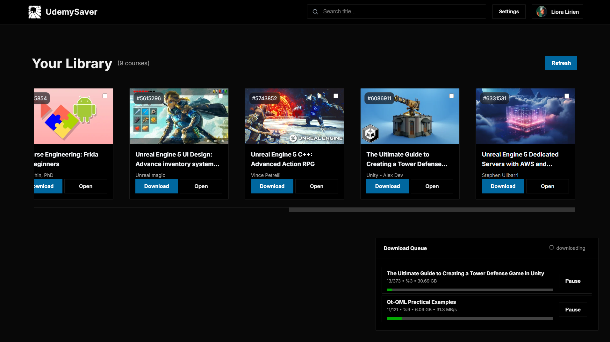
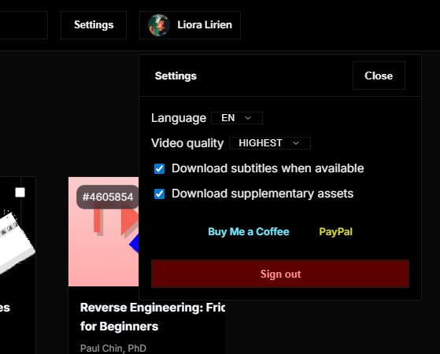

# UdemySaver
UdemySaver is an open-source Udemy course downloader written in modern C++20. It lets you save videos, subtitles, and course assets you own for offline learning. 
A built-in HTTP server powers a responsive web interface so you can browse your Udemy library, queue downloads, and monitor progress from any browser.

## Features
- Download Udemy courses, lectures, subtitles, and attachments for offline access.
- Responsive web interface to browse your Udemy library.
- Queue and monitor downloads for single lectures or entire courses.
- Automatically organizes files under a structured `downloads/` directory.
- Cross-platform build via CMake for Windows, macOS, and Linux.

## Showcase



# Requirements
| Tool/Library           | Notes                     |
| ---------------------- | ------------------------- |
| C++20 compiler         | MSVC / Clang / GCC        |
| CMake ≥ 3.8            | Build system              |
| Boost (system, thread, beast) | Networking primitives     |
| libcurl                | HTTP requests & downloads |
| nlohmann\_json         | JSON parsing              |

## Build from source

```bash
git clone https://github.com/jadis0x/UdemySaver.git
cd UdemySaver
cmake -S . -B build
cmake --build build
```

## Configuration
Create a settings.ini alongside the executable:
```bash
# UdemySaver settings
# http_proxy=http://127.0.0.1:8080   ; optional
udemy_access_token=PASTE_YOUR_TOKEN_HERE
udemy_api_base=https://www.udemy.com
download_subtitles=true
download_assets=true   
```
You can also start the program without a token and paste it via the web interface; the file will be created automatically.

## Obtaining the access token

1. Log in to Udemy in your browser.
2. Open the developer tools (F12) and head to the Application/Storage tab.
3. Under **Cookies** for `www.udemy.com`, copy the value of `access_token`.
4. Use this value in `settings.ini` or paste it into the web UI when prompted.

## Usage

1. Run the application:

```bash
./UdemySaver
```

2. Open a browser at <http://127.0.0.1:8080>.
3. If prompted, paste your Udemy access token.
4. Browse your library, choose a course, and click **Download**.
5. Files are saved under a `downloads/` directory.

## Legal
This tool is intended for downloading courses you have legally purchased.
Respect Udemy's Terms of Service and local laws when using it.

## License
This project is licensed under the [MIT License](LICENSE).
